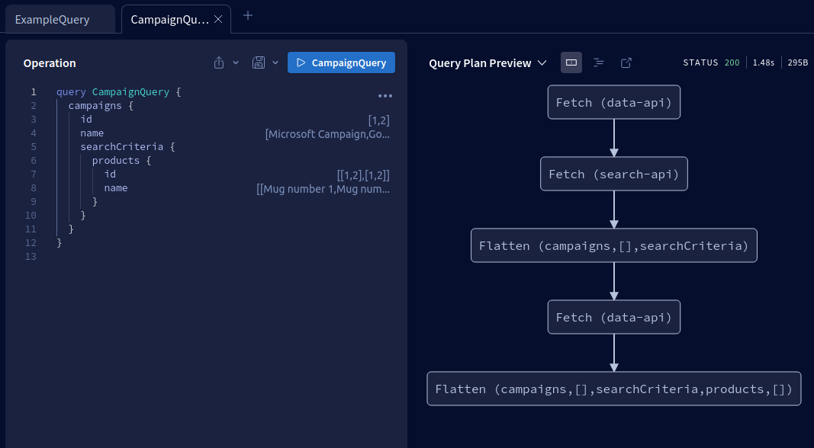

# Product Call Graph

## Product Query

```
query ProductsQuery($input: ProductSearchInput!) {
  products(input: $input) {
    id
    name
  }
}
# variables
{
  "input": {
    "query": "mugs"
  }
}
```

### Product Result 

```
{
  "data": {
    "products": [
      {
        "id": "1",
        "name": "Mug number 1"
      },
      {
        "id": "2",
        "name": "Mug number 2"
      }
    ]
  }
}
```

# Campaign Call Graph 



## Campaign Query

```
query CampaignQuery {
  campaigns {
    id
    name
    searchCriteria {
      products {
        id
        name
      }
    }
  }
}

```

### Result

```
{
  "data": {
    "campaigns": [
      {
        "id": "1",
        "name": "Microsoft Campaign",
        "searchCriteria": {
          "products": [
            {
              "id": "1",
              "name": "Mug number 1"
            },
            {
              "id": "2",
              "name": "Mug number 2"
            }
          ]
        }
      },
      {
        "id": "2",
        "name": "Google Campaign",
        "searchCriteria": {
          "products": [
            {
              "id": "1",
              "name": "Mug number 1"
            },
            {
              "id": "2",
              "name": "Mug number 2"
            }
          ]
        }
      }
    ]
  }
}
```

# apollo_graphql

```
gem install sinatra graphql apollo-federation
gem install solargraph
gem install bundler bundle
gem install webrick
gem install json
gem install rack
gem install rack-graphiql
gem install puma
gem install byebug
```

# install rover

```
curl -sSL https://rover.apollo.dev/nix/latest | sh
```

# rover check & publish

```
rover subgraph check --name search-api --schema ./search.schema sean-halpins-team-2-tncpb@main
rover subgraph publish --name search-api --schema ./search.schema sean-halpins-team-2-tncpb@main
```

```
rover subgraph check --name data-api --schema ./data.schema sean-halpins-team-2-tncpb@main
rover subgraph publish --name data-api --schema ./data.schema sean-halpins-team-2-tncpb@main
```

# curl search svc 

```
curl -X POST \
-H "Content-Type: application/json" \
-d '{
  "query": "query ExampleQuery($input: ProductSearchInput!) { products(input: $input) { id name } }",
  "variables": {
    "input": {
      "query": "mug"
    }
  }
}' \
https://sean-halpin-studious-space-telegram-pq9w549pq9f7rp-4567.preview.app.github.dev/graphql
```

# run

```
rackup -q ./search-svc/config/config.ru -s puma -p 4567
rackup -q ./data-svc/config/config.ru -s puma -p 7654
```